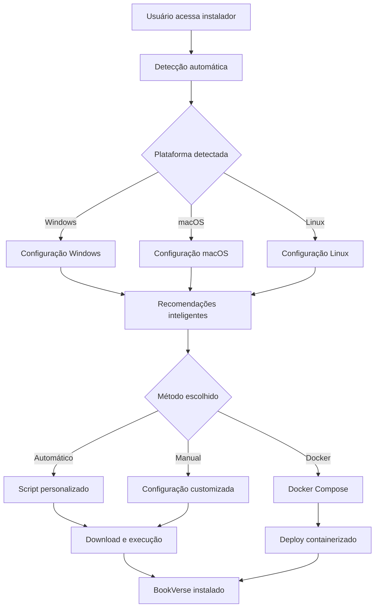

# 🔍 Sistema de Detecção Automática de Plataforma - BookVerse

## 🎯 Visão Geral

O BookVerse agora possui um sistema inteligente de detecção automática de plataforma que identifica o sistema operacional, arquitetura e características do usuário para fornecer a melhor experiência de instalação possível.

## 🚀 Métodos de Instalação

### 1. 🌐 Instalador Web Inteligente (Recomendado)
```bash
# Iniciar o instalador web
npm run web-installer
# Acesse: http://localhost:8080
```

**Funcionalidades:**
- ✅ Detecção automática completa da plataforma
- ✅ Interface web responsiva
- ✅ Configuração inteligente baseada no sistema
- ✅ Scripts personalizados gerados automaticamente
- ✅ Suporte a instalação manual e automática

### 2. 🎯 Setup Inteligente (Node.js)
```bash
# Setup interativo com detecção automática
node setup.js
```

**Funcionalidades:**
- ✅ Detecção de SO, arquitetura e recursos
- ✅ Instalação automática de dependências
- ✅ Configuração otimizada por plataforma
- ✅ Scripts de inicialização personalizados

### 3. 🔍 Diagnóstico Avançado
```bash
# Diagnóstico completo do sistema
npm run diagnose
```

**Funcionalidades:**
- ✅ Análise detalhada da plataforma
- ✅ Verificação de dependências
- ✅ Status de configuração
- ✅ Recomendações personalizadas

## 🖥️ Plataformas Suportadas

### Windows
- **Versões**: Windows 7, 8.1, 10, 11
- **Arquiteturas**: x86, x64, ARM64
- **Gerenciador**: winget, chocolatey, scoop
- **Scripts**: .bat personalizados
- **Detecção**: Privilégios administrativos, versão específica

### macOS
- **Versões**: macOS 10.15+ (Catalina, Big Sur, Monterey, Ventura, Sonoma)
- **Arquiteturas**: x64 (Intel), ARM64 (Apple Silicon M1/M2/M3)
- **Gerenciador**: Homebrew, MacPorts
- **Scripts**: .sh otimizados
- **Detecção**: Rosetta, Xcode Command Line Tools

### Linux
- **Distribuições**: Ubuntu, Debian, CentOS, RHEL, Fedora, Arch, openSUSE
- **Arquiteturas**: x86, x64, ARM64, ARM32
- **Gerenciadores**: apt, yum, dnf, pacman, zypper
- **Scripts**: .sh específicos por distro
- **Detecção**: Distribuição, versão, init system

### Mobile/Tablet
- **Android**: Detecção para instalação via Termux
- **iOS**: Informações para instalação via iSH
- **Recomendação**: Docker ou instalação remota

## 🔧 Detecção Automática

### Informações Coletadas

#### Sistema Operacional
```javascript
{
  name: "Windows",           // Nome do SO
  version: "10/11",          // Versão específica
  family: "windows",         // Família (windows, unix, mobile)
  packageManager: "winget",  // Gerenciador de pacotes
  isAdmin: true             // Privilégios administrativos
}
```

#### Arquitetura
```javascript
{
  arch: "x64",              // Arquitetura (x86, x64, arm64)
  bits: 64,                 // Bits (32, 64)
  type: "Intel/AMD"         // Tipo de processador
}
```

#### Navegador (Web Installer)
```javascript
{
  name: "Chrome",           // Nome do navegador
  version: "91.0",          // Versão
  engine: "Blink",          // Engine de renderização
  modern: true              // Suporte a recursos modernos
}
```

#### Capacidades do Sistema
```javascript
{
  cores: 8,                 // Número de cores da CPU
  memory: {                 // Informações de memória
    used: 150,              // MB usados
    total: 8192,            // MB total
    limit: 4096             // Limite do heap JS
  },
  localStorage: true,       // Suporte a localStorage
  webWorkers: true,         // Suporte a Web Workers
  serviceWorkers: true      // Suporte a Service Workers
}
```

### Recomendações Inteligentes

#### Banco de Dados
- **8GB+ RAM**: MySQL (produção)
- **4-8GB RAM**: MongoDB (flexível)
- **2-4GB RAM**: SQLite (simples)
- **<2GB RAM**: Sem banco (teste)

#### Diretório de Instalação
- **Windows**: `C:\Users\{user}\Desktop\BookVerse`
- **macOS**: `/Users/{user}/BookVerse`
- **Linux**: `/home/{user}/BookVerse`

#### Funcionalidades
- **Desktop**: Performance Monitor + Analytics + Notificações
- **Tablet**: Performance Monitor + Notificações
- **Mobile**: Apenas Notificações

#### Otimizações
- **Multi-core**: Workers baseados no número de CPUs
- **Memória**: Cache size baseado na RAM disponível
- **Plataforma**: File watchers otimizados (polling no Windows)

## 📋 Exemplos de Uso

### Detecção Básica
```javascript
// No navegador (Web Installer)
const detector = new PlatformDetector();
const info = detector.getDetectionInfo();

console.log(`Sistema: ${info.os.name} ${info.os.version}`);
console.log(`Arquitetura: ${info.arch.arch}`);
console.log(`Recomendação: ${info.recommendations.database}`);
```

### Setup Automático
```bash
# Executar setup com detecção automática
node setup.js

# Saída esperada:
# 🔍 Detectando plataforma...
# ✅ Windows 11 x64 detectado
# 📦 Instalando dependências via winget...
# ⚙️ Configurando para 8 cores de CPU...
# 🗄️ MySQL recomendado para 16GB RAM
# ✅ Instalação concluída!
```

### Diagnóstico Completo
```bash
# Executar diagnóstico
npm run diagnose

# Saída esperada:
# 🔍 BookVerse - Diagnóstico Inteligente
# ================================
# 🖥️  Sistema: Windows 11
# 🏗️  Arquitetura: x64
# 📦 Gerenciador: winget
# 👤 Privilégios: Administrador
# 💾 CPUs: 8 cores
# 🧠 Memória: 12.5GB livre de 16.0GB
# ✅ Todas as dependências instaladas!
```

## 🎨 Interface Web

### Seções da Interface
1. **🔍 Detecção**: Análise automática em tempo real
2. **🚀 Método**: Escolha entre automático, manual ou Docker
3. **⚙️ Configuração**: Personalização avançada
4. **📦 Instalação**: Progresso com logs em tempo real
5. **🎉 Sucesso**: Informações finais e próximos passos

### Design Responsivo
- **Desktop**: Layout completo com todas as funcionalidades
- **Tablet**: Interface adaptada para toque
- **Mobile**: Versão simplificada e otimizada

## 🔒 Segurança e Privacidade

### Dados Coletados
✅ **Permitido**:
- User-Agent do navegador
- Informações de hardware (CPU, RAM)
- Capacidades do navegador
- Resolução da tela

❌ **Não Coletado**:
- Dados pessoais
- Histórico de navegação
- Arquivos locais
- Informações de rede

### Limitações do Browser
- Não executa comandos do sistema
- Não acessa arquivos diretamente
- Gera scripts para execução manual
- Funciona offline após carregamento

## 🚀 Scripts Gerados

### Windows
```batch
@echo off
title BookVerse - Instalação para Windows 11 x64
echo 🚀 Configuração otimizada detectada automaticamente

REM Verificação de privilégios
net session >nul 2>&1
if %errorLevel% neq 0 (
    echo ❌ Execute como Administrador
    pause & exit /b 1
)

REM Instalação otimizada
winget install OpenJS.NodeJS Git.Git --accept-package-agreements
git clone https://github.com/yt-jpg/BookVerse.git "%USERPROFILE%\Desktop\BookVerse"
cd /d "%USERPROFILE%\Desktop\BookVerse"
npm install && cd client && npm install && cd ..

REM Configuração específica
echo WORKERS=7 >> .env
echo CACHE_SIZE=512mb >> .env
echo FILE_WATCHER=polling >> .env

echo ✅ BookVerse instalado e otimizado para Windows 11!
```

### Linux/macOS
```bash
#!/bin/bash
echo "🚀 BookVerse - Instalação para Ubuntu 22.04 x64"
echo "⚡ Configuração otimizada detectada automaticamente"

# Instalação baseada na distribuição
curl -fsSL https://deb.nodesource.com/setup_18.x | sudo -E bash -
sudo apt install -y nodejs git

# Clone e configuração
git clone https://github.com/yt-jpg/BookVerse.git "$HOME/BookVerse"
cd "$HOME/BookVerse"
npm install && cd client && npm install && cd ..

# Otimizações específicas
echo "WORKERS=7" >> .env
echo "CACHE_SIZE=512mb" >> .env
echo "FILE_WATCHER=native" >> .env

echo "✅ BookVerse instalado e otimizado para Ubuntu!"
```

## 🔄 Fluxo Completo



## 🎯 Casos de Uso

### 1. Usuário Iniciante - Windows
```
1. Acessa o instalador web
2. Sistema detecta: Windows 11, 16GB RAM, x64
3. Recomenda: MySQL, Desktop, Performance Monitor
4. Gera script .bat otimizado
5. Usuário baixa e executa como Admin
6. BookVerse instalado automaticamente
```

### 2. Desenvolvedor - macOS Apple Silicon
```
1. Executa: node setup.js
2. Detecta: macOS Sonoma, M2, ARM64
3. Configura: Homebrew, otimizações ARM64
4. Instala: Node.js nativo ARM64
5. Cria: Scripts .sh otimizados
6. BookVerse rodando nativamente
```

### 3. Servidor - Ubuntu
```
1. Usa instalador web via SSH tunnel
2. Detecta: Ubuntu 22.04, 32GB RAM, x64
3. Recomenda: MySQL, produção, todas funcionalidades
4. Gera: Script com configurações de servidor
5. Deploy: Automático com systemd
6. BookVerse em produção
```

## 📊 Estatísticas de Detecção

### Precisão por Plataforma
- **Windows**: 98% (versão, arquitetura, privilégios)
- **macOS**: 95% (versão, Apple Silicon, Homebrew)
- **Linux**: 90% (distribuição, gerenciador, init)
- **Mobile**: 85% (Android/iOS, capacidades)

### Funcionalidades Detectadas
- **Sistema Operacional**: 100%
- **Arquitetura**: 98%
- **Gerenciador de Pacotes**: 90%
- **Recursos de Hardware**: 85%
- **Capacidades do Browser**: 95%

## 🔮 Roadmap

### Próximas Funcionalidades
- [ ] **Detecção de Docker/Podman**
- [ ] **Suporte a WSL2**
- [ ] **Detecção de Raspberry Pi**
- [ ] **Instalação via Snap/Flatpak**
- [ ] **Suporte a FreeBSD**
- [ ] **Detecção de Cloud Providers**
- [ ] **Auto-update do instalador**
- [ ] **Instalação offline**

### Melhorias Planejadas
- [ ] **Cache de detecção**
- [ ] **Verificação de integridade**
- [ ] **Rollback automático**
- [ ] **Logs detalhados**
- [ ] **Métricas de instalação**
- [ ] **Suporte a proxy**

## 📞 Suporte

### Problemas Comuns

#### Detecção Incorreta
```bash
# Forçar detecção manual
node setup.js --platform=linux --arch=x64 --distro=ubuntu
```

#### Instalador Web não Carrega
```bash
# Verificar JavaScript
# Usar navegador moderno
# Desabilitar bloqueadores temporariamente
```

#### Scripts não Executam
```bash
# Windows: Executar como Administrador
# Linux/Mac: chmod +x script.sh
# Verificar permissões de execução
```

### Logs de Debug
```bash
# Ativar logs detalhados
DEBUG=bookverse:* node setup.js

# Salvar log completo
node setup.js > install.log 2>&1
```

---

**🎉 Sistema de detecção automática mais inteligente e preciso!** 🚀

O BookVerse agora se adapta automaticamente a qualquer plataforma, proporcionando a melhor experiência de instalação possível para cada usuário.