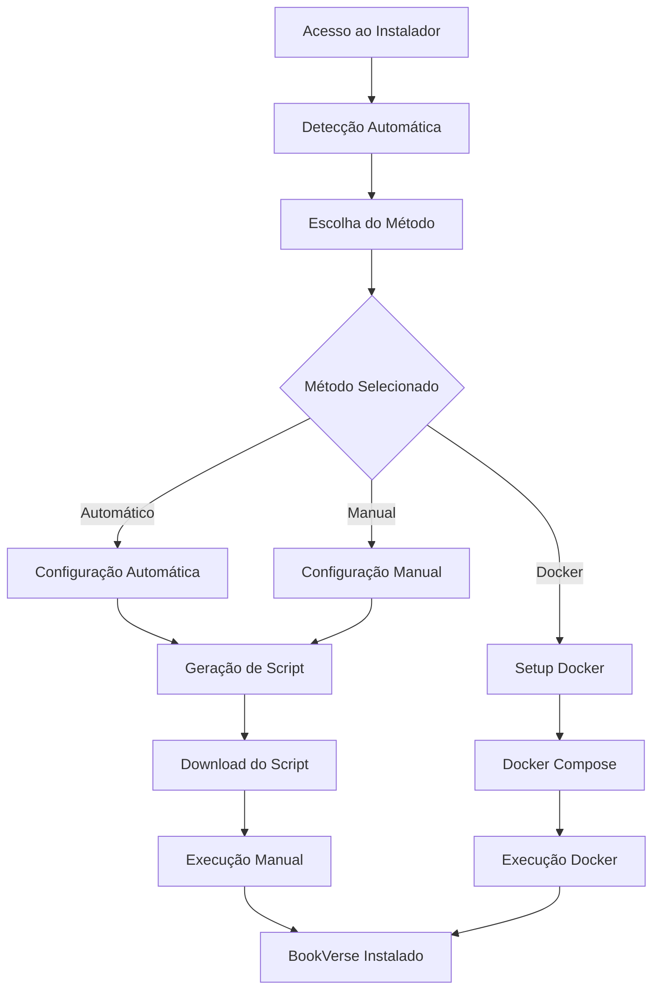

# 🌐 BookVerse - Instalador Web Inteligente

## 🎯 Visão Geral

O Instalador Web Inteligente do BookVerse detecta automaticamente a plataforma do usuário e configura a instalação de forma otimizada. Funciona diretamente no navegador e gera scripts personalizados para cada sistema operacional.

## ✨ Funcionalidades

### 🔍 Detecção Automática
- **Sistema Operacional**: Windows, macOS, Linux (Ubuntu, Debian, CentOS, Fedora, Arch)
- **Arquitetura**: x64, x86, ARM64, Apple Silicon
- **Navegador**: Chrome, Firefox, Safari, Edge
- **Capacidades**: Memória, CPU cores, WebGL, Service Workers
- **Dispositivo**: Desktop, Tablet, Mobile

### 🚀 Métodos de Instalação
1. **Automática (Recomendado)**
   - Detecção completa da plataforma
   - Configuração otimizada automaticamente
   - Banco de dados sugerido baseado no sistema
   - Scripts personalizados gerados

2. **Manual**
   - Controle total das configurações
   - Seleção de diretório personalizada
   - Escolha de banco de dados
   - Funcionalidades opcionais

3. **Docker**
   - Instalação em containers
   - Ambiente isolado
   - Configuração rápida

### 🎛️ Configurações Inteligentes

#### Banco de Dados
- **MySQL**: Recomendado para sistemas com 4GB+ RAM
- **MongoDB**: Para sistemas com 2-4GB RAM
- **SQLite**: Para sistemas com menos recursos ou testes
- **Nenhum**: Apenas para desenvolvimento

#### Funcionalidades Opcionais
- **Monitor de Performance**: Monitoramento em tempo real
- **Analytics**: Estatísticas de uso
- **Notificações**: Sistema de notificações push

#### Otimizações por Plataforma
- **Windows**: File watcher polling, scripts .bat
- **macOS**: Homebrew, scripts .sh, otimizações Apple Silicon
- **Linux**: Detecção de distribuição, gerenciador de pacotes apropriado

## 🛠️ Como Usar

### 1. Acesso Direto
```bash
# Servir localmente
cd installers/web-installer
python -m http.server 8080
# Ou
npx serve .
```

Acesse: `http://localhost:8080`

### 2. Integração no Projeto
```html
<!-- Incluir no seu site -->
<iframe src="installers/web-installer/index.html" width="100%" height="600px"></iframe>
```

### 3. Deploy Online
Faça upload dos arquivos para qualquer servidor web:
- `index.html`
- `style.css`
- `platform-detector.js`
- `installer.js`

## 📋 Estrutura de Arquivos

```
web-installer/
├── index.html              # Interface principal
├── style.css               # Estilos responsivos
├── platform-detector.js    # Detecção de plataforma
├── installer.js            # Lógica do instalador
└── README.md               # Esta documentação
```

## 🔧 Detecção de Plataforma

### Informações Coletadas
```javascript
{
  os: {
    name: "Windows",
    version: "10/11",
    family: "windows",
    packageManager: "winget"
  },
  arch: {
    arch: "x64",
    bits: 64,
    type: "Intel/AMD"
  },
  browser: {
    name: "Chrome",
    version: "91.0",
    engine: "Blink",
    modern: true
  },
  device: {
    type: "desktop",
    mobile: false,
    tablet: false,
    touchScreen: false,
    resolution: { width: 1920, height: 1080 }
  },
  capabilities: {
    localStorage: true,
    webWorkers: true,
    serviceWorkers: true,
    cores: 8,
    memory: { used: 150, total: 8192 }
  }
}
```

### Recomendações Geradas
```javascript
{
  installMethod: "auto",
  database: "mysql",
  directory: "C:\\Users\\User\\Desktop\\BookVerse",
  features: ["performance", "notifications", "analytics"],
  optimizations: ["multicore", "webworkers", "pwa"]
}
```

## 🎨 Interface

### Seções da Interface
1. **Detecção**: Análise automática do sistema
2. **Método**: Escolha do tipo de instalação
3. **Configuração**: Personalização (manual)
4. **Instalação**: Progresso em tempo real
5. **Sucesso**: Informações finais e próximos passos

### Design Responsivo
- **Desktop**: Layout em grid com cards
- **Tablet**: Adaptação para telas médias
- **Mobile**: Interface otimizada para toque

## 🔒 Segurança e Privacidade

### Dados Coletados
- ✅ Informações do navegador (User-Agent)
- ✅ Capacidades do sistema (CPU, memória)
- ✅ Resolução da tela
- ❌ Nenhum dado pessoal
- ❌ Nenhum tracking externo

### Limitações do Browser
- Não pode executar comandos do sistema
- Não pode acessar arquivos locais diretamente
- Gera scripts para execução manual

## 🚀 Scripts Gerados

### Windows (.bat)
```batch
@echo off
title BookVerse - Instalação Automática
echo 🚀 Instalando BookVerse para Windows 10/11

REM Verificar privilégios administrativos
net session >nul 2>&1
if %errorLevel% neq 0 (
    echo ❌ Execute como Administrador
    pause
    exit /b 1
)

echo 📦 Instalando dependências...
winget install OpenJS.NodeJS --accept-package-agreements
winget install Git.Git --accept-package-agreements

echo 📥 Baixando BookVerse...
git clone https://github.com/yt-jpg/BookVerse.git "C:\Users\User\Desktop\BookVerse"
cd /d "C:\Users\User\Desktop\BookVerse"

echo 📦 Instalando dependências do projeto...
npm install
cd client && npm install && cd ..

echo ⚙️ Configurando ambiente...
copy .env.example .env
copy client\.env.example client\.env

echo ✅ Instalação concluída!
echo 🚀 Execute: npm run dev
pause
```

### Linux/macOS (.sh)
```bash
#!/bin/bash
echo "🚀 Instalando BookVerse para Ubuntu 20.04"

echo "📦 Instalando dependências..."
curl -fsSL https://deb.nodesource.com/setup_18.x | sudo -E bash -
sudo apt install -y nodejs git

echo "📥 Baixando BookVerse..."
git clone https://github.com/yt-jpg/BookVerse.git "/home/user/BookVerse"
cd "/home/user/BookVerse"

echo "📦 Instalando dependências do projeto..."
npm install
cd client && npm install && cd ..

echo "⚙️ Configurando ambiente..."
cp .env.example .env
cp client/.env.example client/.env

echo "✅ Instalação concluída!"
echo "🚀 Execute: npm run dev"
```

## 🎯 Casos de Uso

### 1. Usuário Iniciante
- Acessa o instalador web
- Clica em "Instalação Automática"
- Baixa e executa o script gerado
- BookVerse instalado e configurado

### 2. Desenvolvedor Experiente
- Escolhe "Instalação Manual"
- Personaliza diretório e banco de dados
- Seleciona funcionalidades específicas
- Obtém configuração customizada

### 3. Administrador de Sistema
- Usa "Instalação Docker"
- Deploy em múltiplos servidores
- Ambiente isolado e padronizado

## 🔄 Fluxo de Instalação



## 🌟 Vantagens

### Para Usuários
- **Simplicidade**: Um clique para detectar e configurar
- **Personalização**: Controle total quando necessário
- **Compatibilidade**: Funciona em qualquer navegador moderno
- **Segurança**: Nenhum dado pessoal coletado

### Para Desenvolvedores
- **Manutenção**: Fácil de atualizar e expandir
- **Flexibilidade**: Suporte a novas plataformas
- **Analytics**: Dados de uso para melhorias
- **Distribuição**: Pode ser hospedado em qualquer lugar

## 🔮 Futuras Melhorias

- [ ] Suporte a mais distribuições Linux
- [ ] Detecção de Docker/Podman
- [ ] Instalação via package managers (Snap, Flatpak)
- [ ] Suporte a ARM32
- [ ] Integração com CI/CD
- [ ] Instalação offline
- [ ] Verificação de integridade
- [ ] Auto-update do instalador

## 📞 Suporte

Para problemas com o instalador web:
1. Verifique se JavaScript está habilitado
2. Use um navegador moderno (Chrome 80+, Firefox 75+, Safari 13+)
3. Desabilite bloqueadores de script temporariamente
4. Abra as ferramentas de desenvolvedor para ver erros

---

**🎉 Instalação inteligente e automática para qualquer plataforma!** 🚀